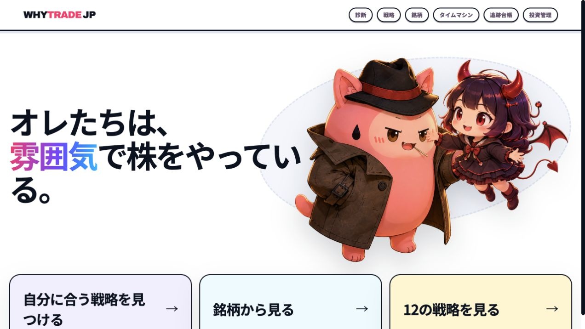
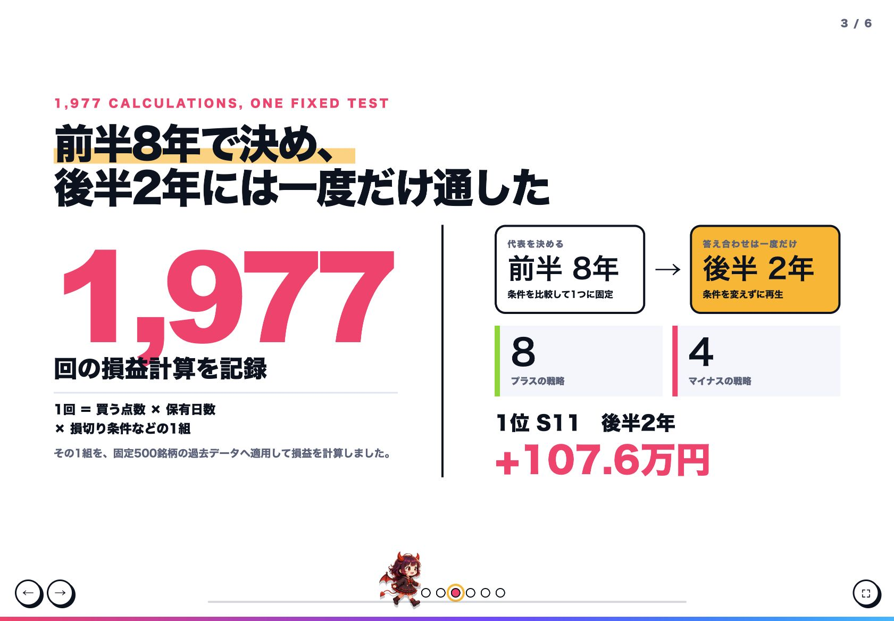
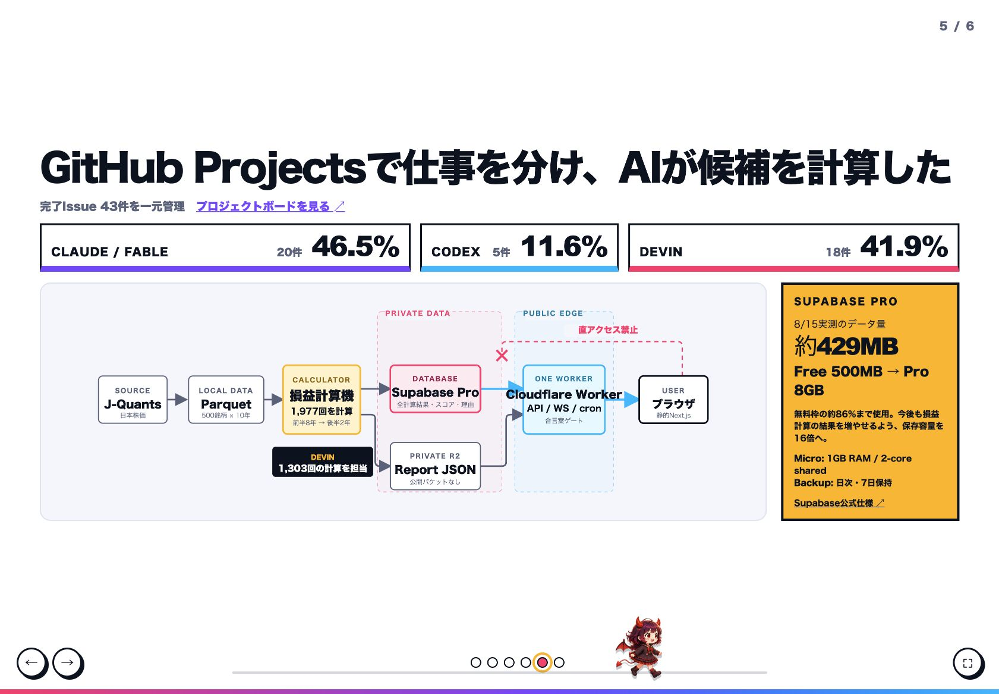
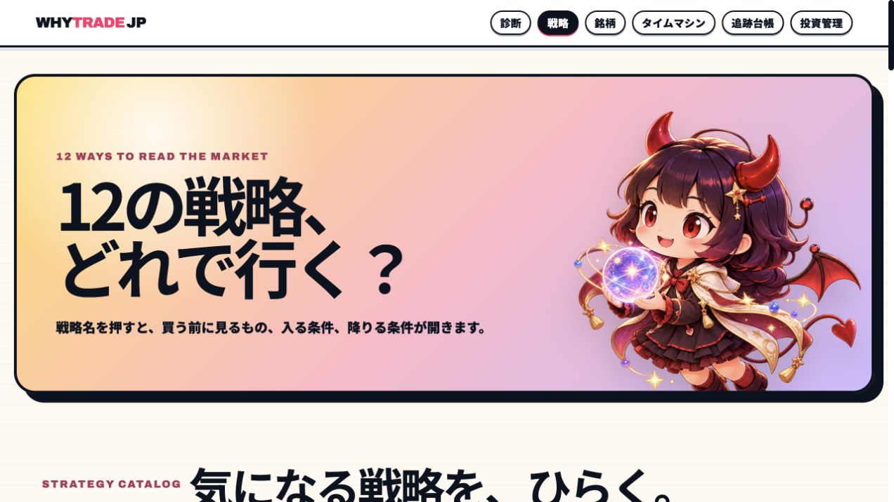

# WhyTrade JP

> オレたちは、雰囲気で株をやっている。
> だから、その雰囲気を質問で言葉にし、同じ考え方で過去10年を検証できるサービスを作りました。

**WhyTrade JP**は、8つの質問から利用者の投資観を整理し、12種類の投資戦略から相性のよい候補を提示する日本株シミュレーションサービスです。

診断で終わらず、その戦略が過去に「いつ買い、いつ売り、資産がどう動いたか」をタイムマシンで再生できます。

| 提出項目 | 内容 |
|---|---|
| チーム名 | **Atmosphere** |
| メンバー | きよごん、とばっち、たく |
| タイトル | **WhyTrade JP「オレたちは、雰囲気で株をやっている。」** |
| イベント | AIAU Craft Day「3日間でアプリ・サービスをローンチせよ！」 |
| サービスURL | [WhyTrade JPを開く](https://whytrade.kaminokuresse.workers.dev/)（イベント用合言葉で保護） |
| 公開プレゼン | [横スクロール版を見る](https://whytrade.kaminokuresse.workers.dev/presentation/) |
| GitHub | [提出用Publicリポジトリ](https://github.com/kiyogon/whytrade-jp-showcase) |



## サービスの説明

WhyTrade JPは、直感的な投資判断を再現可能な条件へ変換し、その条件を過去データで確かめるサービスです。

利用者は次の流れで、自分の考え方と検証結果を確認します。

1. 名前、生年月日、8つの投資質問に答える。
2. 「下落をどこまで許容するか」「業績と値動きのどちらを重視するか」などの投資観を整理する。
3. 事前検証済みの12戦略から、相性のよい戦略を最大3件表示する。
4. 選んだ戦略の後半2年間をタイムマシンで再生する。
5. 判断日、約定日、売買価格、売却理由、資産推移、現在の仮想売買プランを確認する。

誕生日から生成する星図は、診断を楽しむための演出です。

戦略の順位は、星座ではなく8つの投資質問への回答から決まります。

## AIに「勝てる戦略を探して」と頼まなかった

短期間で都合のよい結果だけを選ばないため、探索前に作り方を固定しました。

1. 業績重視、トレンド重視など、12種類の投資スタイルを先に決める。
2. 買う点数、保有日数、損切り幅など、変更できる戦略パラメーターを有限個に限定する。
3. 同じ入力なら誰が実行しても同じ結果になる損益計算機を作る。
4. 前半8年だけで候補を比較し、各スタイルの代表ルールを固定する。
5. 後半2年には、固定したルールを一度だけ適用する。

この工程で、固定500銘柄の過去データに対して**1,977回の損益計算**を実行し、結果を保存しました。

ここでいう1回は、「買う点数、保有日数、損切り条件などをまとめた1組」を固定500銘柄へ適用した計算です。



## 数字で見る結果

| 項目 | 結果 |
|---|---:|
| 対象 | 日本株の固定500銘柄 |
| データ期間 | 約10年 |
| 初期資金 | 100万円 |
| 投資スタイル | 12種類 |
| 損益計算 | **1,977回** |
| Devinが担当した計算 | **1,303回（約65.9%）** |
| 後半2年がプラス | **8戦略** |
| 後半2年がマイナス | **4戦略** |
| 後半2年の1位 | **S11 流動性ブレイク型、+107.6万円** |

手数料は1注文115円、価格のずれは0.1%として計算しています。

プラスの戦略だけを残していません。

後半2年でマイナスになった4戦略も、同じ基準で画面と記録に残しています。

## Devinの活用

Devinには、曖昧な指示から戦略を発明させるのではなく、固定済みの損益計算機へ割り当てられた候補を流す役割を任せました。

複数のDevinが、全1,977回のうち**1,303回（約65.9%）**を担当しました。

| 段階 | Devinが行ったこと |
|---|---|
| Round 0 | 計算機の再現性と実チャートとの一致を確認 |
| Round 1 | 各スタイルの候補を広く計算 |
| Round 2 | 前半8年の上位候補の近傍だけを追加計算 |
| Round 3 | 上位候補を再計算し、代表ルールを固定して後半2年へ一度だけ適用 |

探索中はコード変更を禁止し、同じ計算機バージョン、同じデータ、同じ期間を使用しました。

結果が0件でも、損失でも、失敗でも記録を残し、計算機の異常を見つけた場合は探索を止めて報告する運用にしています。

この制約により、AIを大量実行の担当者として活用しながら、評価基準を途中で動かさない探索を実現しました。

## Supabaseの活用

Supabaseは、画面で使う構造化データと、探索で得た計算結果、スコア、判断理由の保存先として利用しています。

2026年8月15日時点の実測データ量は**約429MB**でした。

Freeプランのデータベース上限500MBに対して約86%に達していたため、計算結果を今後も追加できるようProプランへ移行しました。

| Proプランで得た余裕 | WhyTradeでの意味 |
|---|---|
| ディスク8GB込み | Freeの500MBから保存余力を広げ、計算結果と判断理由を追加できる |
| Micro Compute | 1GB RAM、2-core shared CPUでPostgresを運用できる |
| 日次バックアップ | 直近7日分のバックアップから復旧できる |

Supabaseの仕様は、[Compute and Disk](https://supabase.com/docs/guides/platform/compute-and-disk)、[Disk Size](https://supabase.com/docs/guides/platform/manage-your-usage/disk-size)、[Database Backups](https://supabase.com/docs/guides/platform/backups)で確認できます。

ブラウザからSupabaseへは直接接続しません。

管理権限はCloudflare Workerだけが保持し、画面は同一オリジンのAPIを通じてデータを取得します。

## システム構成



```text
J-Quants
  ↓
ローカルParquet（固定500銘柄、約10年）
  ↓
Python損益計算機
  ├─ Supabase Pro（計算結果、スコア、判断理由）
  └─ 非公開Cloudflare R2（画面用Report JSON）
        ↓
Cloudflare Worker（API、WebSocket、日次更新、合言葉ゲート）
        ↓
Next.jsで作ったブラウザ画面
```

全銘柄の重い元データと計算はローカルのParquetで扱い、画面に必要な結果だけをクラウドへ置きます。

この分離により、ブラウザへデータベースの管理権限を渡さない構成にしました。

## 実際の画面

| トップページ | 12戦略の一覧 |
|---|---|
|  |  |

診断結果から戦略を選ぶと、タイムマシンで資産推移と売買履歴を日付ごとに再生できます。

売買履歴には、判断日、銘柄、株数、約定価格、損益、売却理由を表示します。

実発注の経路は持たず、基準日時点の仮想売買プランまでを提示します。

## その他のアピールポイントと創意工夫

### 説明を後付けしない

買い候補の点数と判断理由は、同じ計算式から生成します。

結果が出た後に、LLMへもっともらしい説明を作らせる方式ではありません。

### 診断と検証を一つの体験にした

質問への回答を12戦略へ結びつけ、その戦略の過去2年間の売買まで再生します。

「自分に合いそう」と「過去にどう動いたか」を同じ画面導線で確認できます。

### 占いの楽しさと投資ロジックを分離した

出生星図やキャラクターは、難しい投資条件へ入りやすくするための演出です。

戦略の順位と売買判断には、星座や生成AIの自由回答を使いません。

### 負けた戦略も見せる

後半2年でマイナスになった戦略も削除せず表示します。

どの条件がどの期間で通用しなかったかを確認できることも、サービスの価値として扱いました。

### 判断をタイムマシンで再生する

資産曲線だけでなく、買った日、売った日、損切り、条件のよい銘柄への入れ替えを日付順に追えます。

過去の流行語を流すシアター演出と音を組み合わせ、2年間の相場を短時間で振り返れる画面にしました。

## AIチームとプロジェクト管理

3日間の作業はGitHub ProjectsでIssueへ分割し、主担当と完了状態を一元管理しました。

主担当AIを特定できる完了Issueは43件です。

| 主担当 | 完了Issue | 比率 | 主な役割 |
|---|---:|---:|---|
| Claude / Fable | 20件 | 46.5% | 計画、損益計算機、探索ルール、裁定 |
| Codex | 5件 | 11.6% | 画面、演出、公開プレゼン |
| Devin | 18件 | 41.9% | パラメーター探索、再現確認 |

Fableが計算機と探索規律を作り、Solが相互レビューし、複数のDevinが候補を並行計算し、Codexが画面と演出へ反映しました。

人間は、投資スタイル、許容する前提、採用基準、発表内容の最終判断を担当しました。

## 技術スタック

| 領域 | 技術 |
|---|---|
| フロントエンド | Next.js 16、React 19、Three.js |
| API | Cloudflare Workers、Hono |
| リアルタイム同期 | Durable Objects、PartyServer |
| データベース | Supabase Pro、PostgreSQL |
| レポート配信 | Cloudflare R2 |
| 損益計算 | Python 3.11以上、pandas、NumPy、PyArrow |
| 株価データ | J-Quants API |
| プロジェクト管理 | GitHub Issues、GitHub Projects |

## 審査員向けの実装アクセス

このPublicリポジトリは、ハッカソン提出用の紹介資料です。

ソースコード、株価データ、環境設定、PrivateリポジトリのGit履歴は含めていません。

実装本体はPrivateの[kiyogon/whytrade-jp](https://github.com/kiyogon/whytrade-jp)にあります。

審査員は、接続済みのDevin管理者アカウントから実装本体を確認できます。

## 前提と対象範囲

- 本サービスは投資判断の検証用シミュレーションであり、投資助言や将来の利益を保証するものではありません。
- 対象は固定500銘柄、買いのみ、日足、最大5銘柄です。
- 後半2年の結果を確認した後に、戦略パラメーターを再調整していません。
- 手数料115円と価格のずれ0.1%はハッカソン用の仮定として、画面にも表示しています。
- 実発注機能はありません。

## 公開範囲とライセンス

Copyright © 2026 Team Atmosphere.

本リポジトリはハッカソン審査用の紹介資料として公開しています。

オープンソースライセンスは付与していません。
